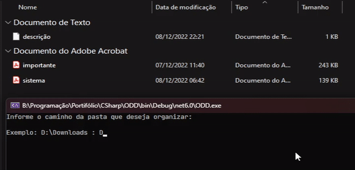

<h1 align="center"> Organizador de Download </h1>

Projeto exclusivamente console, feito para por em prática os conhecimentos adquiridos.

  <a href="#-projeto">Projeto</a>&nbsp;&nbsp;&nbsp;|&nbsp;&nbsp;&nbsp;
  <a href="#%EF%B8%8F-tecnologias">Tecnologias</a>&nbsp;&nbsp;&nbsp;|&nbsp;&nbsp;&nbsp;
  <a href="#%EF%B8%8F-demo">Demo</a>&nbsp;&nbsp;&nbsp;|&nbsp;&nbsp;&nbsp;
    <a href="#%EF%B8%8F-Roadmap">Roadmap</a>&nbsp;&nbsp;&nbsp;|&nbsp;&nbsp;&nbsp;
  <a href="#memo-licença">Licença</a>

  

## 💻 Projeto

A motivação que levou ao desenvolvimento desse projeto, foi para solucionar um problema de aglomeração de arquivos em minha pasta de downloads. E a categorização de arquivos baseada em sua extensão facilita na hora de encontrar e organizar os arquivos.

## 🏗️ Tecnologias

Esse projeto foi desenvolvido com as seguintes tecnologias:

- C#;
- .NET 6.0;

## ⚙️ DEMO

O programa compara os arquivos listados no diretório com os formatos de arquivo mais conhecidos, e os agrupa em quatro pastas diferentes.

- Documentos
- Imagens
- Música
- Vídeo

## 🗺️ Roadmap

**[Aqui](https://github.com/FHumberto/PES-PF-ODD/wiki)** você encontra a lista com as futuras atualizações desse projeto.

## :memo: Licença

Esse projeto está sob a licença MIT.

---